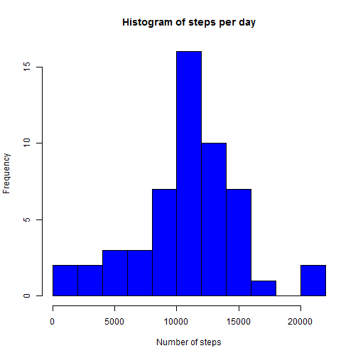
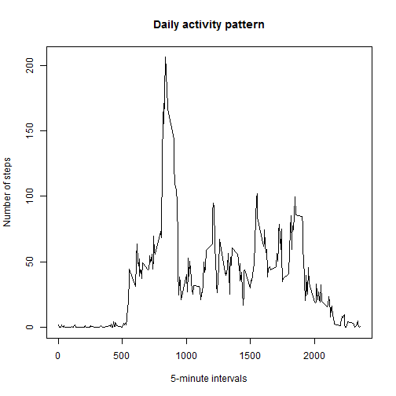
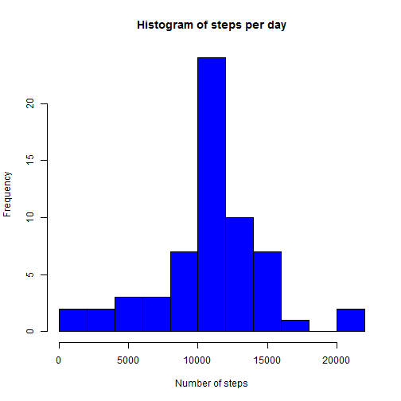
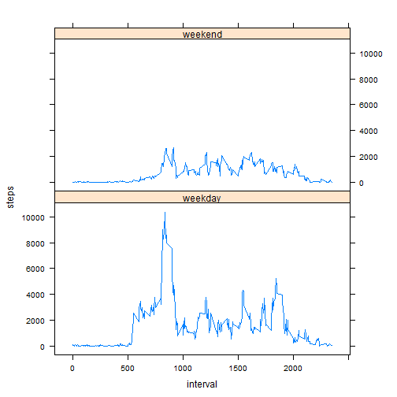

## Loading and preprocessing the data

Before starting the analysis, we are going to load the packages and the data that will be used. Then, we modify the *date* variable so that it has the appropriate format.


```r
library(lattice)
data <- read.csv("./activity.csv")
data$date <- as.Date(data$date)
head(data)
```

```
##   steps       date interval
## 1    NA 2012-10-01        0
## 2    NA 2012-10-01        5
## 3    NA 2012-10-01       10
## 4    NA 2012-10-01       15
## 5    NA 2012-10-01       20
## 6    NA 2012-10-01       25
```

Note that the *interval* variable indicates the starting time of the 5-minute intervals. For example, the value 435 refers to the interval that goes from 04:35:00 to 04:39:59.


## What is mean total number of steps taken per day?

**1. Calculate the total number of steps taken per day.**

We use the *aggregate()* function and store it in a new dataframe called *perday* that has a row for each day.


```r
perday <- aggregate(data$steps, list(day=data$date), sum)
colnames(perday) <- c("day", "steps")
```

**2. Make a histogram of the total number of steps taken each day**

In order to improve the appearance of the histogram we change the number of breaks.


```r
hist(perday$steps, breaks=10, main="Histogram of steps per day", xlab="Number of steps", col="blue")
```

 

**3. Calculate and report the mean and median of the total number of steps taken per day**


```r
mean(perday$steps, na.rm=T)
```

```
## [1] 10766.19
```

```r
median(perday$steps, na.rm=T)
```

```
## [1] 10765
```

Hence, the mean number of steps taken per day is 10766.19 steps and the median is 10765 steps. 


## What is the average daily activity pattern?

**1. Make a time series plot of the 5-minute interval and the average number of steps taken, averaged accross all days.**

Again, we use the aggregate function and create a new dataframe called *perinterval* with the information needed to make the time series plot.


```r
perinterval <- aggregate(data$steps, list(interval=data$interval), mean, na.rm=T)
colnames(perinterval) <- c("interval", "steps")
plot(perinterval$interval,perinterval$steps, type="l", main="Daily activity pattern", xlab="5-minute intervals", ylab="Number of steps")
```

 

**2. Which 5-minute interval, on average accross all days in the dataset, contains the maximum number of steps?**


```r
maximum <- which(perinterval$steps == max(perinterval$steps))
perinterval[maximum,]
```

```
##     interval    steps
## 104      835 206.1698
```

The maximum number of steps are taken in the interval beginning at 08:35.


## Imputing missing values

**1. Calculate and report the total number of missing values in the dataset**


```r
nmis <- sum(is.na(data$steps))
```

There are 2304 missing values in the data set.

**2. Devise a strategy for filling in all the missing values in the data set**

The strategy we have chosen to deal with the missing values is to replace them with the mean of the corresponding 5-minute interval.

**3. Create a new dataset that is equal to the original dataset but with the missing data filled in**

The new dataset will be called *dataimp*.

```r
dataimp <- data
for(i in 1:dim(dataimp)[1]){
   if(is.na(dataimp$steps[i])){
      dataimp$steps[i] <- perinterval[perinterval$interval==dataimp$interval[i],"steps"]
   }
}
```

**4. Make a histogram of the total number of steps taken each day and calculate the mean and median total number of steps taken per day**

Using the *aggregate()* function again, we create the dataframe containing the total number of steps taken each day after the imputation of missing values. Then te histogram is done and the mean and the median computed.


```r
perdayimp <- aggregate(dataimp$steps, list(day=dataimp$date), sum)
colnames(perdayimp) <- c("date", "steps")
hist(perdayimp$steps, breaks=10, main="Histogram of steps per day", xlab="Number of steps", col="blue")
```

 

```r
mean(perdayimp$steps)
```

```
## [1] 10766.19
```

```r
median(perdayimp$steps)
```

```
## [1] 10766.19
```

After the imputation of both the mean and the median take the value 10766.19. Thus, if we compare them with the values obtained before imputating the missing observations we notice that the mean remains the same and the median increases sligthly. In this case, the strategy of replacing the missing values with the mean of the corresponding 5-minute interval does not have a big impact on the total daily number of steps.


## Are there differences in activity patterns between weekdays and weekends?

**1. Create a new factor variable with two levels indicating wether a given date is a weekday or a weekend day.**

First we create the new variable in the dataset that contains all the values and then we aggregate them by interval according to whether the date is a weekday or a weekend day.


```r
dataimp$week <- weekdays(dataimp$date)
for(i in 1:dim(dataimp)[1]){
   if(dataimp$week[i]=="sábado" || dataimp$week[i]=="domingo"){
      dataimp$week[i] <- "weekend"
   } else {
      dataimp$week[i] <- "weekday"
   }
} 
dataimp$week <- as.factor(dataimp$week)
dataweek <- aggregate(dataimp$steps, list(interval=dataimp$interval,week=dataimp$week), sum)
colnames(dataweek) <- c("interval","week","steps")
```

**2. Make the panel plot containing a time series plot of the 5-minute interval and the average number of steps taken, averaged accross all weekday days or weekend days**

This is straigthforward using the *xyplot()* function of the *lattice* package.


```r
xyplot(steps~interval| week, data=dataweek, type="l", layout=c(1,2))
```

 
